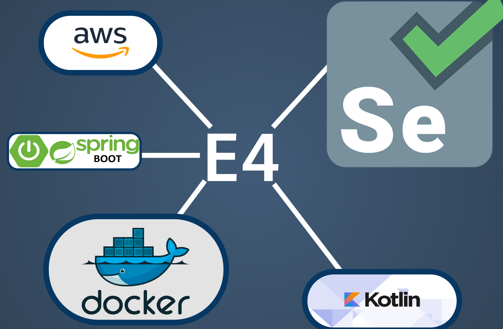
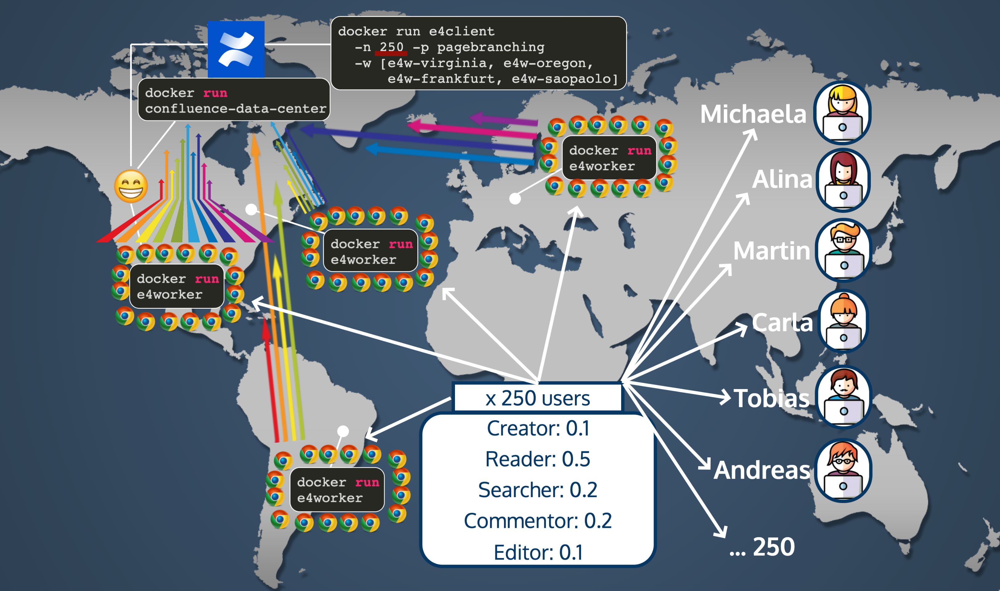

# E4 - The enjoyable performance testing framework

E4 is intended for performance and scale testing web applications with arbitrarily many browser agents running on arbitrarily many "worker nodes" around the globe. Check out the [E4 presentation](https://slides.com/fgrund/e4/live) for an introduction.

## Disclaimer

This project is work in progress; as is the documentation. We promise it will grow. While E4 is applicable for any web application, it is currently being used and designed as performance testing framework for Atlassian's data center products. This documentation is currently specific still specific to Atlassian applications, and, for now, particularly Confluence. This will change in the future.

**Everything in this documentation may be short-lived because E4 is under active development.**




## Test Packages

### What is a test package?

A test package is a bunch of Kotlin source files that define how an app can be properly tested. The intention is that the test package is independent from any structural components and focuses on the tasks that are required to test the app.

### Components of a test package

Each test package has a set of components that have certain purposes. All sources for a test package live in `de.scandio.e4.testpackages` in `src/main/kotlin/` and `src/test/kotlin/`.

#### TestPackage declarator

At the top level is a class that extends `TestPackage`. It defines the following:
* Virtual Users: a set of simulated users that perform actions against a running application
* Weights: in what quantities/relations/ratios should virtual users be distributed onto worker threads? 
* Setup Actions: a set of actions that must be executed before the virtual users can be simulated

#### Virtual User

Classes in the sub-package `virtualusers` that define virtual users. A virtual user executed a set of actions, each of which can be measured in terms of `time_taken`. The docs of a virtual user should include the following:
* Assumptions: what is assumed in the environment before the virtual user can be simulated?
* Preparation: what actions must be performed before the virtual user can be simulated?
* Actions: what actions are performed by the virtual user. These can involve both Selenium tasks and REST calls.

#### Action

Classes in the sub-package `actions` that define actions invoked by virtual users. Actions define what steps should be measured as `time_taken`. This allows to run procedures that are not measured (e.g. login procedures). The docs of an action should include the following:
* Assumptions: what is assumed in the environment before the action can be executed
* Procedure: what are the actual procedures performed in the action. These can involve both Selenium tasks and REST calls.
* Result: what is the result if the action was executed successfully

### How do I test/run/develop a test package?

For development of a test package, create a unit test class in your Kotlin test package that extends `TestPackageTestRun`. This class will define the following:
* BASE_URL: the base url of a running and accessible instance of your app to be used for running the tests
* IN_DIR (optional): absolute path to a directory where inputs are taken (e.g. files for upload)
* OUT_DIR (optional): absolute path to a directory where output can be saved (e.g. Selenium screenshots)
* USERNAME: username of the application user to be used for the test run (e.g. "admin")
* PASSWORD: password of the application user to be used for the test run (e.g. "admin")
* TEST_PACKAGE: an instance of your TestPackage declarator class
* PREPARATION_RUN: boolean indicating if this should be a preparation run. If set to true, only the setup actions of your test package will be executed. If set to false, only the virtual users of your test package will be executed (we want to do this differently in the future).

In `@Before` call `super.setup()`. Then, define one `@Test` method like this:
```
@Test
fun runTest() {
    try {
        if (PREPARATION_RUN) {
            executeTestPackagePrepare(TEST_PACKAGE)
        } else {
            executeTestPackage(TEST_PACKAGE)

            // Run a single action for testing:
            // executeAction(CreatePageAction("MYSPACEKEY", "MYPAGETITLE"))

            // Run single virtual user for testing:
            // executeActions(BranchCreator().actions)
        }
    } finally {
        super.shutdown()
    }
}
```

Then run the unit test from within the IDE with a running application at the specified BASE_URL.

#### Examples

There is a (pretty much) completed test package for the app *Page Branching for Confluence* in the package `de.scandio.e4.testpackages.pagebranching`. There is a test package class `PageBranchingTestPackage`. Then, there is a unit test class as described above in `/test` in package `de.scandio.e4.testpackages.pagebranching` named `PageBranchingTestRun`. The constants need to be adjusted to your environment first (yes, these could be outside the source code but that's more annoying during for development). After the properties are set, the class can be run as a simple unit test from within the IDE.
